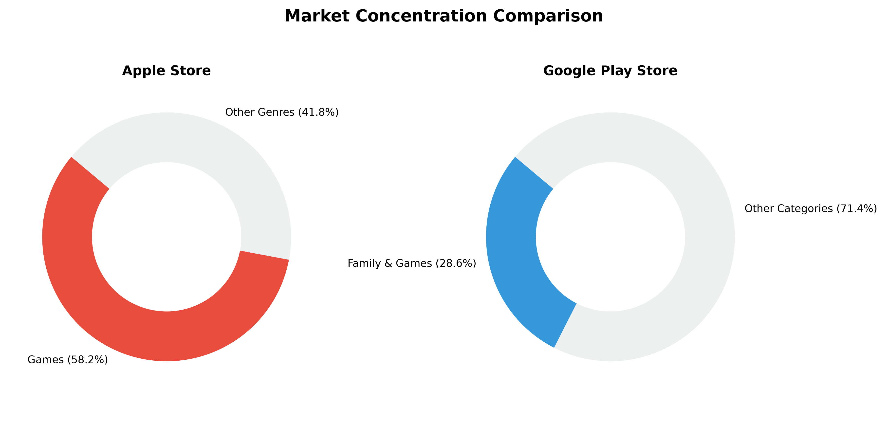
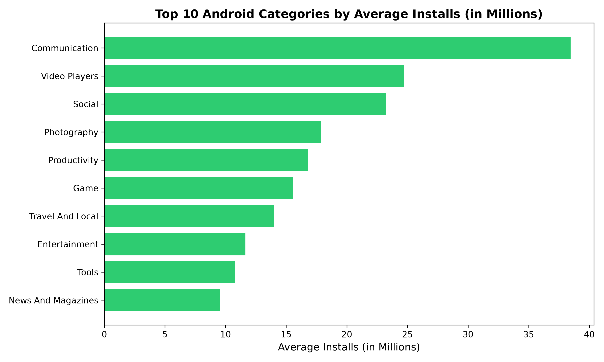
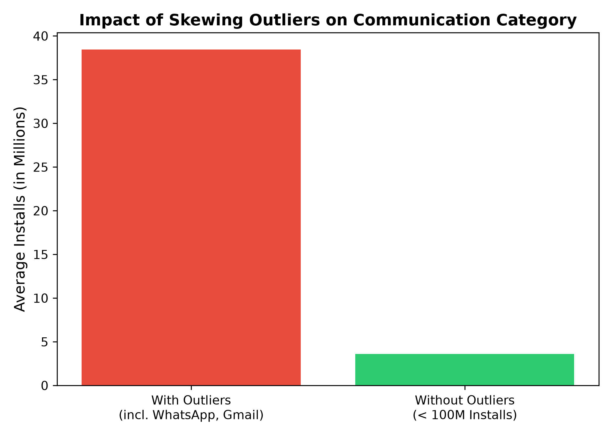

<div align="center">

# 📱 Mobile App Market Analysis: Google Play vs. App Store

**A data-driven exploration of free mobile applications on the **Google Play Store** and **Apple App Store**. This project cleans raw store data and analyzes category distribution, install counts, and cross-platform market focus to help developers make informed product decisions.**


</div>

---

## 📌 Business Problem & Objectives

In the crowded mobile application ecosystem, building an app without market validation risks launching into highly saturated or giant-dominated categories. Acting as a lead Data Analyst for an ad-supported app development firm, this project analyzes historical datasets from the **[Apple App Store](data/AppleStore.csv)** and **[Google Play Store](data/googleplaystore.csv)** to locate viable product niches.

### Core Goals
* **🧹 Clean & Standardize:** Normalize distinct store attributes across 18,000+ app entries.
* **📈 Measure Engagement:** Evaluate user audience reach across 30+ unique app genres.
* **🎯 Identify High-Growth Niches:** Isolate unsaturated market segments with strong cross-platform demand.

---

## 📊 Key Insights & Visualizations

### 1. Cross-Platform Market Composition

<div align="center">
  
</div>

> [!NOTE]
> * **iOS App Store is Gaming-Dominated:** Over **58.2%** of all free apps fall into the Gaming genre.
> * **Google Play Store is Diversified:** Games and Family apps make up only **28.6%**, leaving **71.4%** distributed across productivity, tools, and lifestyle apps.

---

### 2. Category Reach vs. Data Skewness

| Category Demand (Android) | Statistical Outlier Impact |
| :--- | :--- |
|  |  |
| **Top Categories:** **Communication** leads Google Play with an average of **~38.5M installs**, followed by **Video Players** (~24.7M) and **Social** (~23.2M). | **Impact of Skewness:** Removing 100M+ mega-apps (e.g., WhatsApp, Gmail) drops Communication from **38.5M to 3.6M installs** (~90.6% reduction). |

---

## 💡 Final Conclusion & Recommendation

> [!TIP]
> ### 🏆 Winning Product Concept: Feature-Rich Interactive Book App
> Instead of building a generic ebook reader or library app (which competes directly with Amazon Kindle and Google Play Books), build a **dedicated interactive application around a single popular book or topic**.

### Key Value Differentiators
* **💬 Interactive Engagement:** Daily quote widgets, progress quizzes, and community reader discussions.
* **🎧 Multimodal Media:** Built-in narration audio with synchronous sentence highlighting.
* **📖 Integrated Utilities:** Built-in dictionary lookups so readers never leave the app interface.

### Platform Strategy
* **App Store (iOS):** Captures high-intent users seeking practical, utility-driven content amidst a store dominated by games.
* **Google Play (Android):** Drives wide reach using a freemium ad-supported model (free chapter access with rewarded video ad unlocks for bonus features).

---

## 🛠️ Tools & Tech Stack

```text
Language     :  Python 3.8+
Visuals      :  Matplotlib, Seaborn
Environment  :  Jupyter Notebook / VS Code
```

---

## 📁 Repository Structure

```text
mobile-app-market-analysis/
├── data/               # Raw datasets
├── notebooks/          # Exploratory Data Analysis & cleaning steps
    └── app_analysis.ipynb
├── visuals/            # Exported charts and summary graphs
├── .gitignore          # Files Git should ignore
├── README.md           # Documentation
└── requirements.txt    # Project dependencies
```

---

## 🚀 How to Run the Project Locally

1. **Clone the repository:**
   ```bash
   git clone https://github.com/Kash4Code/mobile-app-market-analysis.git
   cd mobile-app-market-analysis
   ```
   
2. **Set up a virtual environment**
   ```bash
   python -m venv venv
   # Activate on Windows:
   .\venv\Scripts\Activate.ps1
   # Activate on Mac/Linux:
   source venv/bin/activate
   ```
   
2. **Install dependencies:**
   ```bash
   pip install -r requirements.txt
   ```

3. **Run the analysis:**
   Open `notebooks/app_analysis.ipynb` in Jupyter Notebook or VS Code and execute all cells.

---

## 🌟 Support & Feedback

If you found this project helpful or insightful, please consider **starring** ⭐ the repository and **forking** 🍴 it to build upon it!

Have suggestions or feedback? Feel free to open an issue or connect with me:

[](https://github.com/Kash4Code)
[]([https://linkedin.com](https://www.linkedin.com/in/kashinathrp/))
